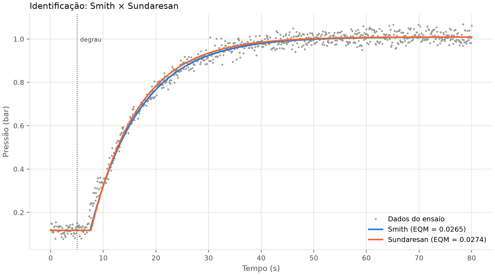
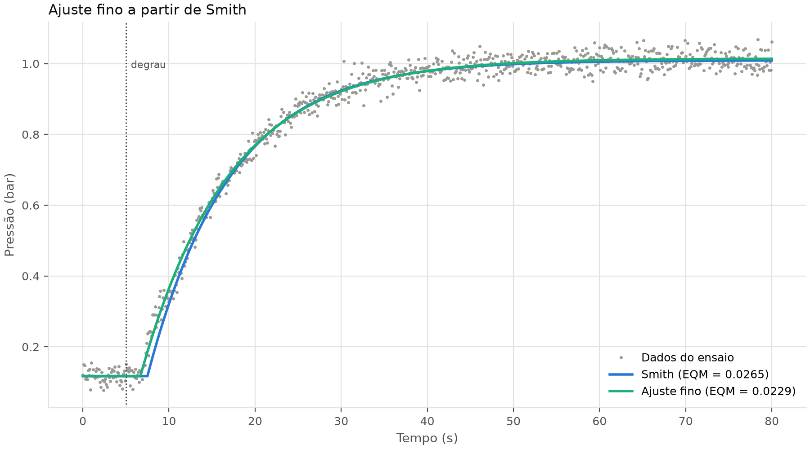
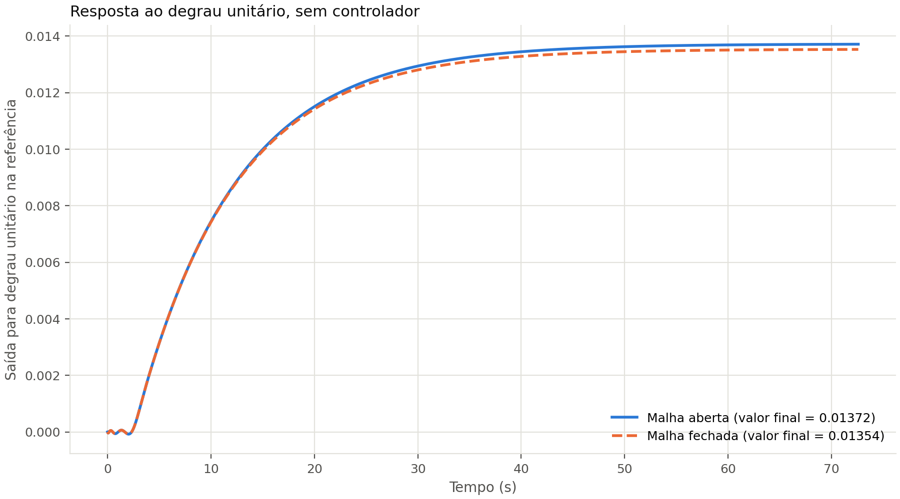
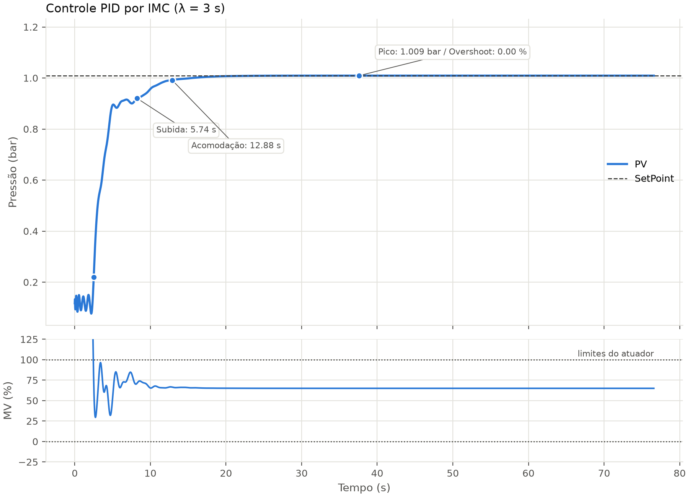
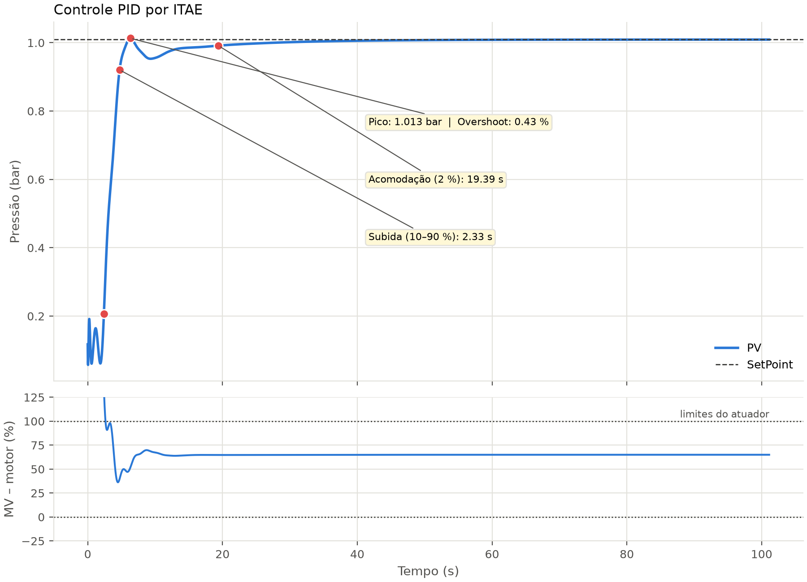
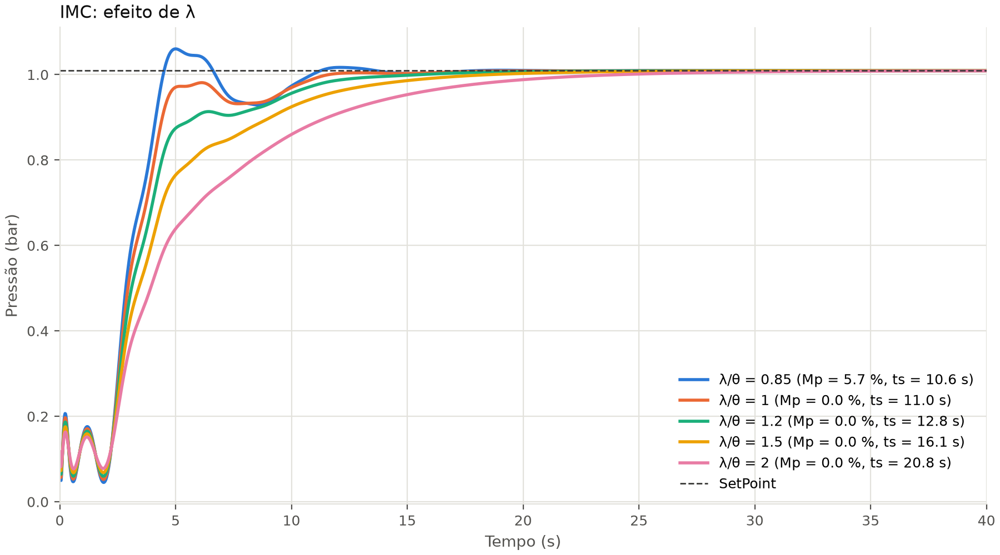
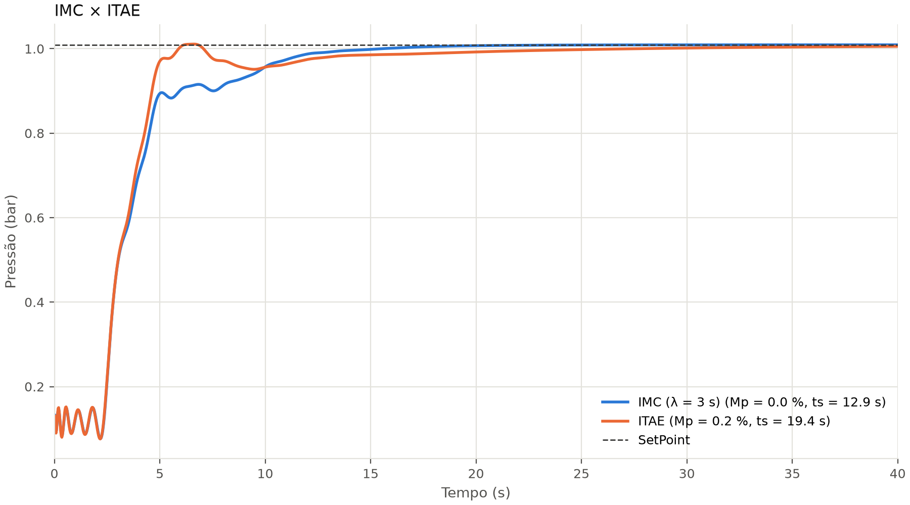
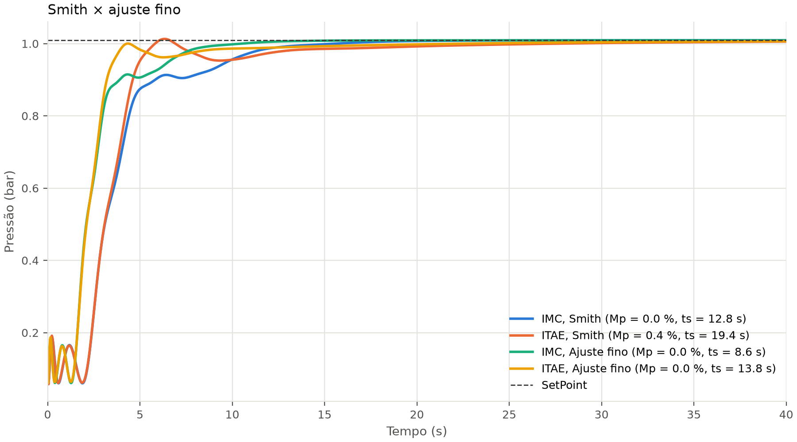
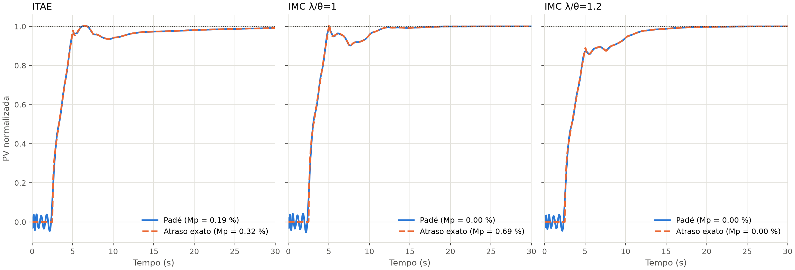

# PP1-C13: Identificação de Processos e Sintonia de Controladores PID

Projeto Prático 1 da disciplina C13 – Sistemas Embarcados.

Integrantes:

- Pedro Paulo de Paiva Junqueira - 1998
- Leandro Teixeira Ambrósio - 
- Luiz Augusto Moreira Barbosa - 

## Sobre o projeto

O trabalho tem duas partes. Na primeira, pegamos o ensaio em malha aberta da planta
(a curva de reação) e tiramos dele um modelo de primeira ordem com atraso. Na
segunda, usamos esse modelo para sintonizar um controlador PID e avaliar a resposta
em malha fechada.

Nós ficamos com a planta pneumática, os métodos de sintonia IMC e ITAE e o
critério de menor índice de overshoot. Fizemos tudo em Python, com a interface em
PyQt5.

## A planta

Na Tabela 7 do enunciado a planta do Grupo 3 é o cilindro pneumático. O ensaio não mede posição: mede a pressão no reservatório, em bar, e é essa a variável que o controlador regula.

Um motor elétrico aciona um compressor, que manda ar para um reservatório. A pressão
sobe até a vazão de entrada empatar com o que sai pelo consumo e pelos vazamentos. O
controlador mede essa pressão, compara com o SetPoint e ajusta o comando do motor
entre 0 e 100 %.

Numa montagem real usaríamos um transmissor de pressão piezoresistivo (saída de
4–20 mA ou 0–10 V, lida por um conversor A/D) como sensor e um inversor de frequência
como atuador do motor. Se o motor fosse CC, um driver PWM faria o mesmo papel. O PID
rodaria em um microcontrolador ou CLP, e uma válvula de alívio protegeria o
reservatório.

| | Variável | Faixa |
|---|---|---|
| Controlada (PV) | Pressão no reservatório | 0,12 bar com o motor parado, 1,01 bar com 65 % (ensaio) e perto de 1,49 bar com 100 %, pelo modelo |
| Manipulada (MV) | Comando do motor | 0 a 100 % |
| Perturbações | Consumo de ar, vazamentos, temperatura do ar e variação da tensão da rede | |

## Como rodar

Precisa de Python 3.10 ou mais novo. Usamos o 3.13.

```bash
git clone https://github.com/junqueora/PP1-C13.git
cd PP1-C13

python3 -m venv .venv
source .venv/bin/activate        # Windows: .venv\Scripts\activate
pip install -r requirements.txt

python main.py
```

No PyCharm é só abrir a pasta, criar o interpretador em `.venv`, instalar o
`requirements.txt` e rodar o `main.py`.

Os scripts abaixo refazem as tabelas e as figuras que aparecem neste README. Rode
sempre a partir da raiz do projeto:

```bash
python scripts/rodar_identificacao.py   # identificação e ajuste fino
python scripts/rodar_sintonia.py        # malha aberta x fechada, PID e ajuste fino
python scripts/validar_pade.py          # comparação do Padé com o atraso exato
python -m pytest                        # testes dos cálculos
```

## Usando a interface

A janela tem quatro abas.

**Início** apresenta o projeto, o grupo, a planta, os métodos escolhidos e um passo a
passo de uso. O botão "Começar" leva para a aba Identificação.

Em **Identificação**, clique em "Escolher arquivo" e selecione
`data/Pneumatico_G3.mat`. O programa valida o arquivo, aplica Smith e Sundaresan e
já mostra o que teve menor EQM. Dá para alternar entre os dois métodos e o ajuste
fino. Os valores de k, τ, θ e EQM são só para leitura. Quando o arquivo traz os
parâmetros com que o ensaio foi gerado, eles aparecem no painel ao lado do gráfico,
junto com o motivo de a escolha usar o EQM mesmo com ruído.

A aba **Controle PID** só é liberada depois que um dataset válido é carregado. Nela
há duas formas de sintonia:

- **Método**: Kp, Ti e Td são calculados pela regra escolhida e ficam travados. O
  único valor editável é o λ, e só quando o método é o IMC.
- **Manual**: Kp, Ti e Td ficam livres. O botão "Sintonizar" verifica se a malha é
  estável antes de simular. No modo Método ele continua visível, mas desabilitado.

O SetPoint começa no valor final do ensaio e pode ser alterado. A faixa acima do
gráfico diz qual modelo da identificação está sendo usado na sintonia. No IMC, o
aviso de status compara o ts simulado com 4λ. As caixinhas ao lado de tr, ts e Mp
marcam esses pontos no gráfico. O rótulo com o valor de cada ponto aparece quando o
mouse passa sobre ele. "Exportar" salva a figura, já com todos os rótulos visíveis.

A aba **Relatório** é liberada junto com a de controle. Ela monta um PDF em A4 com o
que está selecionado nas outras abas: identificação (tabela dos métodos e curva de
reação), sintonia atual (parâmetros, métricas e resposta) e comparação dos métodos
(tabela dos seis métodos e gráfico IMC × ITAE). Dá para escolher as seções, ver a
prévia de cada página e clicar em "Gerar PDF".

## Extras da interface

Além do que o enunciado pede, a interface tem:

- **Gráfico do sinal de controle (MV)** abaixo da resposta, com os limites do motor.
- **Pico, erro em regime e MV máx** na lateral, junto de tr, ts e Mp.
- **Aviso de saturação** quando o comando do motor sai de 0–100 % no transitório, e
  quando o SetPoint exige mais motor do que existe em regime.
- **Ajuste fino** do modelo na aba Identificação, que pode ser usado na sintonia.
- **Parâmetros de referência do arquivo** (k, τ e θ com que o ensaio foi gerado) ao
  lado do modelo identificado.
- **Limitar motor a 0–100 %**: simula com o atuador saturado, anti-windup e atraso
  exato. Mostra a resposta realista; ver a seção "Limitações".
- **Comparar IMC × ITAE**: desenha as duas sintonias no mesmo gráfico, com o mesmo
  SetPoint, o λ atual e a mesma opção de limite do motor.
- **Rótulos no hover**: os valores de tr, ts e pico aparecem ao passar o mouse sobre
  os pontos.
- **Relatório em PDF** com identificação, sintonia atual e comparação dos métodos.
- **Nota da ondulação do Padé** no gráfico, explicando que a oscilação inicial vem da
  aproximação e não existe na planta.

## Resultados

### Dataset

São 801 amostras, de 0 a 80 s com passo de 0,1 s. O degrau vai de 0 para 65 % em
t = 5 s e a pressão sai de 0,117 e chega a 1,009 bar. Com isso o ganho é
k = Δy/Δu = 0,892/65 = 0,01372 bar/%.

### Identificação

O sinal tem bastante ruído, então procuramos os instantes de cruzamento em uma média
móvel de 9 amostras. O EQM é calculado contra os dados originais.

| Método | k (bar/%) | τ (s) | θ (s) | θ/τ | EQM (bar) |
|---|---|---|---|---|---|
| Smith | 0,01372 | 9,60 | 2,50 | 0,26 | 0,02654 |
| Sundaresan | 0,01372 | 9,00 | 2,65 | 0,29 | 0,02738 |

Ficamos com o Smith, que teve o menor EQM. O arquivo descreve ruído uniforme de
2,5 % mais jerk, e o enunciado aponta o Sundaresan como mais adequado para amostra
ruidosa. O critério que desempata os dois, na seção 6.2, é o menor EQM, e por ele o
Smith se ajusta melhor. Os parâmetros usados para gerar o ensaio também estão no
arquivo: k = 0,01374 bar/%, τ = 10 s e θ = 2 s. A curva sobe sem oscilar depois de um
tempo morto, que é o comportamento de um sistema de primeira ordem com atraso, e por
isso o modelo FOPDT serve bem:

```
G(s) = 0,01372 / (9,6s + 1) · e^(-2,5s)
```



### Ajuste fino

Partindo do modelo de Smith, refinamos k, τ e θ minimizando o EQM.

| Modelo | k | τ (s) | θ (s) | EQM (bar) |
|---|---|---|---|---|
| Smith | 0,01372 | 9,60 | 2,50 | 0,02654 |
| Ajuste fino | 0,01380 | 10,27 | 1,68 | 0,02293 |

O EQM cai 14 %. O parâmetro que mais muda é o atraso: o ruído no começo da
subida empurra para a frente os cruzamentos de 28,3 % e 63,2 %, e o Smith acaba
estimando um θ maior do que o real. O próprio `.mat` traz os parâmetros usados para
gerar os dados (τ = 10 s e θ = 2 s), e eles ficam entre os dois modelos. A sintonia
oficial do PID usa o modelo de Smith. O efeito de trocar para o ajuste fino está
na seção "Efeito do ajuste fino na sintonia".



### Malha aberta e malha fechada sem controlador

Resposta a um degrau unitário na referência:

| Malha | tr (s) | ts (s) | Valor final | Erro em regime |
|---|---|---|---|---|
| Aberta | 21,09 | 40,06 | 0,01372 | 0,986 |
| Fechada | 20,73 | 39,40 | 0,01354 | 0,986 |

As duas curvas praticamente se sobrepõem. Fechar a malha divide a constante de tempo
por (1 + k), só que k é muito pequeno e o ganho de velocidade não chega a 2 %. O erro
em regime continua perto de 99 %, porque a realimentação unitária sozinha não tem
ganho para levar a pressão até a referência. É por isso que o PID é necessário: o
proporcional acelera a resposta e o integral zera o erro.



### Sintonia do PID

Usamos o mesmo degrau do ensaio como SetPoint, de 0,117 para 1,009 bar.

| Técnica | Método | Kp (%/bar) | Ti (s) | Td (s) | tr (s) | ts (s) | Mp (%) |
|---|---|---|---|---|---|---|---|
| 2 | IMC (λ = 3,0 s) | 186,04 | 10,850 | 1,106 | 5,74 | 12,88 | 0,00 |
| 6 | ITAE | 220,68 | 12,670 | 0,847 | 2,20 | 19,39 | 0,19 |

Para o IMC o método exige λ/θ > 0,8. Perto desse limite a resposta é mais rápida,
mas aparece overshoot. Testamos alguns valores:

| λ/θ | 0,85 | 1,0 | 1,2 | 1,5 | 2,0 |
|---|---|---|---|---|---|
| Mp (%) | 9,2 | 0,0 | 0,0 | 0,0 | 0,0 |
| ts (s) | 10,5 | 11,1 | 12,9 | 16,1 | 20,8 |

Escolhemos λ = 1,2·θ = 3,0 s. A regra do método é ts ≈ 4λ, ou seja 12 s; o ts
simulado foi 12,9 s. Com λ/θ = 1 o overshoot já some na simulação com Padé,
mas ainda aparece 0,69 % quando simulamos com o atraso. Com
1,2 ele é zero nos dois casos, e subir mais que isso só deixa a resposta lenta.





### Qual método atende melhor o critério

O critério do grupo é o menor overshoot, e os dois métodos o atendem: o IMC fica em
0,00 % e o ITAE em 0,19 %, praticamente zero nos dois casos (bem abaixo do ruído de
2,5 % do próprio ensaio). Com o atraso exato no lugar do Padé, o ITAE vai a 0,32 % e o
IMC continua em 0,00 %.

Ficamos com o IMC por dois motivos:

- **Acomoda bem mais rápido:** 12,9 s contra 19,4 s do ITAE.
- **O λ dá controle direto** sobre o compromisso entre velocidade e overshoot, o que
  permite deixar uma folga caso o modelo não esteja exato. O ITAE não tem esse ajuste:
  Kp, Ti e Td saem direto da regra.

O ITAE sobe mais rápido (2,2 s contra 5,7 s) porque usa um ganho maior. Por causa
disso encosta no SetPoint logo no início e depois demora para assentar no valor final.



A tabela com os seis métodos do enunciado está em `resultados/sintonia.csv`.

### Efeito do ajuste fino na sintonia

A tabela acima usa o modelo de Smith, que é o resultado do método pedido. O ajuste fino muda sobretudo o atraso (θ de 2,50 s para 1,68 s), então o PID foi recalculado nele, com a mesma regra λ = 1,2·θ.

| Modelo | Método | λ (s) | Kp (%/bar) | Ti (s) | Td (s) | tr (s) | ts (s) | Mp (%) |
|---|---|---|---|---|---|---|---|---|
| Smith | IMC | 3,00 | 186,04 | 10,850 | 1,106 | 5,74 | 12,88 | 0,00 |
| Smith | ITAE | 3,00 | 220,68 | 12,670 | 0,847 | 2,20 | 19,39 | 0,19 |
| Ajuste fino | IMC | 2,02 | 281,59 | 11,110 | 0,777 | 3,86 | 8,64 | 0,00 |
| Ajuste fino | ITAE | 2,02 | 325,50 | 13,303 | 0,589 | 1,57 | 13,76 | 0,00 |

No modelo refinado os dois métodos zeram o overshoot. O IMC continua acomodando antes (8,6 s contra 13,8 s), então a escolha do grupo não muda. O ganho sobe (281 e 325 %/bar): o comando do motor satura ainda mais no início, e a ressalva da simulação linear vale com mais força.



## Limitações

A biblioteca `control` não tem atraso de transporte, então o atraso é representado
pela aproximação de Padé de 10ª ordem, a mesma usada no código base da disciplina
(`cnt.pade(theta, 10)`). Ela cria uma oscilação pequena nos primeiros 2,5 s da
resposta que não existe no processo. Para saber quanto isso afeta os números, o
`scripts/validar_pade.py` simula a mesma malha passo a passo com o atraso exato. Nas
sintonias que usamos, tr e ts mudam menos de 0,05 s e o overshoot menos de 1 ponto
percentual. Em sintonias mais agressivas a diferença cresce.



A derivada pura não dá para simular, então o termo derivativo tem um filtro:
Td·s/(Td/N·s + 1), com N = 10.

A simulação usada nas tabelas é linear e não limita o motor. Com Kp perto de
200 %/bar, o degrau de SetPoint pede bem mais que 100 % do motor no começo (MV máx
de 1825 % no IMC e 2165 % no ITAE). Na planta real ele saturaria e a subida seria
mais lenta. A opção "Limitar motor a 0–100 %" da interface simula isso:

| Método | Simulação | tr (s) | ts (s) | Mp (%) |
|---|---|---|---|---|
| IMC | linear | 5,74 | 12,88 | 0,00 |
| IMC | motor limitado | 12,09 | 28,45 | 0,00 |
| ITAE | linear | 2,20 | 19,39 | 0,19 |
| ITAE | motor limitado | 14,68 | 38,04 | 0,00 |

Com o motor limitado as respostas ficam bem mais lentas, mas a escolha do grupo não
muda: os dois continuam sem overshoot e o IMC acomoda antes.

## Estrutura do repositório

```
PP1-C13/
├── main.py                 abre a interface
├── requirements.txt
├── data/
│   └── Pneumatico_G3.mat   dataset do grupo
├── src/                    cálculos (não dependem da interface)
│   ├── config.py           constantes e caminhos
│   ├── dataset.py          leitura e validação do .mat
│   ├── identificacao.py    Smith, Sundaresan, EQM e ajuste fino
│   ├── modelo.py           FOPDT, Padé, malha aberta e fechada
│   ├── sintonia.py         regras de sintonia e função de transferência do PID
│   ├── metricas.py         tr, ts e overshoot
│   ├── simulacao.py        resposta da malha com PID (linear e com motor limitado)
│   ├── graficos.py         desenho dos gráficos
│   └── relatorio.py        relatório em PDF
├── gui/                    interface em PyQt5
│   ├── janela_principal.py
│   ├── aba_inicio.py
│   ├── aba_identificacao.py
│   ├── aba_controle.py
│   ├── aba_relatorio.py
│   └── widgets.py
├── scripts/                geram as tabelas e figuras deste README
├── tests/                  testes dos cálculos
└── resultados/
    ├── sintonia.csv
    └── figuras/
```
